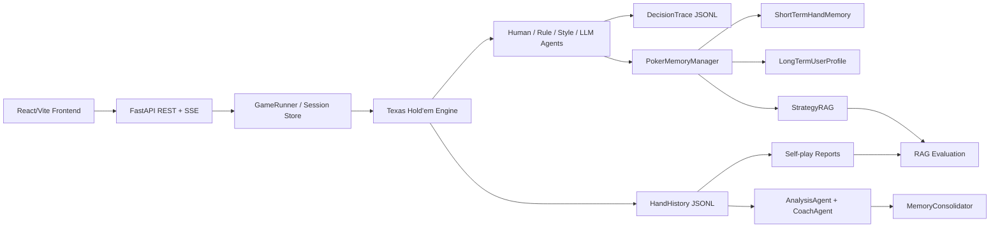

# PokerAgentLab

[中文 README](README.zh-CN.md)

PokerAgentLab is a local-first multi-agent Texas Hold'em training, observability, memory, strategy retrieval, and evaluation platform. It turns a poker game engine into an agent development lab: agents play hands, record decision traces, retrieve strategy knowledge, consolidate user memories, generate coach reports, and run repeatable evaluation benchmarks.

The project is designed as an open-source portfolio project for agent engineering roles. It focuses on the parts that matter in real agent systems: bounded action spaces, tool-style parsing, graceful fallback, traceability, memory lifecycle, RAG explainability, and measurable evaluation.

## Highlights

- **Multi-agent poker runtime**: human, rule-based, style-based, and LLM-compatible agents share one Texas Hold'em engine.
- **Constrained decision loop**: every agent decision is limited by legal poker actions; LLM output is parsed into structured actions with fallback.
- **Decision observability**: JSONL traces record observation, legal actions, chosen action, prompt summary, raw response, fallback reason, memory/RAG references, and latency.
- **SSE trace streaming**: the frontend can receive live agent decisions without polling full trace files.
- **Hermes-inspired memory lifecycle**: short-term hand memory, long-term user profile candidates, strategy retrieval, and coach-confirmed memory promotion.
- **Explainable StrategyRAG**: local keyword/tag retrieval with score breakdown, matched terms, matched tags, source chunk IDs, and retrieval reasons.
- **Coach training reports**: session histories are converted into Chinese training reports with findings, action profile, critical spots, leaks, and drills.
- **Self-play reports**: batch experiments output win rate, BB/100, VPIP, PFR, aggression factor, and action distribution.
- **Evaluation framework**: RAG benchmarks report Hit@K, Precision@K, Recall@K, MRR, and latency; system benchmarks report trace and context coverage.
- **Docker one-command demo**: FastAPI backend plus React static frontend served by nginx with `/api` reverse proxy.

## Product Flow

1. Start a poker session from the React UI or REST API.
2. Human, rule, style, or LLM-compatible agents act inside the same engine.
3. Each action writes a hand history record and a decision trace.
4. StrategyRAG retrieves relevant poker strategy chunks for agent context and debugging.
5. Short-term memory summarizes recent hands; long-term user memories are stored as coach-confirmed candidates.
6. Coach reports analyze the session and generate a training plan.
7. Self-play and evaluation jobs produce measurable reports for comparison and regression checks.

## Architecture



### Backend Modules

```text
agent/        Agent interfaces and human/rule/style/LLM implementations
analysis/     Hand review, style consistency checks, coach training reports
api/          FastAPI schemas, session store, game runner, self-play experiments
engine/       Poker rules, betting rounds, pots, showdown, hand evaluation
evaluation/   RAG and system evaluation runners plus labeled query dataset
memory/       History store, decision traces, user profile memory, StrategyRAG
strategy/     Style profiles, preflop table, postflop heuristics, skill docs
frontend/     React/Vite demo UI
tests/        Smoke tests and memory/RAG/evaluation tests
```

## Requirements

Backend:

- Python 3.11+
- pip
- Python packages in `requirements.txt`

Frontend:

- Node.js 20+
- npm

Optional:

- Docker Desktop for one-command deployment
- LLM-compatible API key if you want real LLM decisions

## Quick Start: Docker

From the repository root:

```powershell
docker compose up --build
```

Open:

```text
Frontend: http://127.0.0.1:5174/
API docs: http://127.0.0.1:8000/docs
Health:   http://127.0.0.1:5174/api/health
```

On Windows you can also double-click:

```text
start_docker.bat
```

Stop containers:

```powershell
docker compose down
```

or double-click:

```text
stop_docker.bat
```

Compose runs two services:

- `api`: FastAPI on container port `8000`, exposed as `127.0.0.1:8000`
- `frontend`: React static build served by nginx on `127.0.0.1:5174`; nginx proxies `/api/*` to `api:8000`

## Quick Start: Local Development

Backend:

```powershell
git clone <your-repo-url>
cd PokerAgentLab
python -m venv venv
.\venv\Scripts\python.exe -m pip install -r requirements.txt
copy .env.example .env
.\venv\Scripts\python.exe -m uvicorn main_api:app --reload --host 127.0.0.1 --port 8000
```

If you use an existing Conda environment:

```powershell
cd PokerAgentLab
C:\Users\93774\.conda\envs\hello_agents\python.exe -m pip install -r requirements.txt
C:\Users\93774\.conda\envs\hello_agents\python.exe -m uvicorn main_api:app --host 127.0.0.1 --port 8000
```

Frontend:

```powershell
cd frontend
npm install
npm run dev
```

Vite defaults to:

```text
http://127.0.0.1:5173/
```

If the port is occupied, Vite may choose another port. The Docker production frontend uses `5174`.

## Environment Variables

Copy `.env.example` to `.env` and edit as needed:

```env
POKER_LLM_ENABLED=false
POKER_LLM_API_KEY=
POKER_LLM_API_BASE=https://open.bigmodel.cn/api/paas/v4
POKER_LLM_MODEL=glm-4-flash

POKER_MEMORY_ENABLED=true
POKER_MEMORY_USER_ID=default_user
POKER_MEMORY_MAX_RECENT_HANDS=5
POKER_STRATEGY_RAG_ENABLED=true
```

LLM play is disabled by default. When `POKER_LLM_ENABLED=false` or the API key is missing, `style: llm` players fall back to a rule agent so the demo, tests, and Docker deployment remain runnable without secrets.

## Core APIs

Session flow:

```text
POST /sessions
GET  /sessions
GET  /sessions/{session_id}
GET  /sessions/{session_id}/state
POST /sessions/{session_id}/action
POST /sessions/{session_id}/continue
GET  /sessions/{session_id}/history
```

Observability and analysis:

```text
GET  /sessions/{session_id}/traces
GET  /sessions/{session_id}/trace-stream
GET  /sessions/{session_id}/hands/{hand_id}/traces
POST /sessions/{session_id}/analyze
POST /sessions/{session_id}/coach
```

Memory and strategy retrieval:

```text
GET  /memory/profile
GET  /memory/profile/candidates
POST /memory/profile/candidates/{memory_id}/accept
POST /memory/profile/candidates/{memory_id}/reject
POST /memory/search
POST /strategy/search
POST /sessions/{session_id}/consolidate
GET  /sessions/{session_id}/memory-context
```

Experiments and evaluation:

```text
POST /experiments/self-play
GET  /experiments/{experiment_id}/report
POST /evaluation/rag
GET  /evaluation/rag/{run_id}
POST /evaluation/system
GET  /evaluation/system/{run_id}
```

Example session:

```powershell
curl -X POST http://127.0.0.1:8000/sessions `
  -H "Content-Type: application/json" `
  -d "{\"session_id\":\"demo1\",\"mode\":\"fixed\",\"num_hands\":3,\"config_path\":\"config/game_config.yaml\"}"

curl http://127.0.0.1:8000/sessions/demo1/state

curl -X POST http://127.0.0.1:8000/sessions/demo1/action `
  -H "Content-Type: application/json" `
  -d "{\"action\":\"call\",\"amount\":0}"
```

Example self-play:

```powershell
curl -X POST http://127.0.0.1:8000/experiments/self-play `
  -H "Content-Type: application/json" `
  -d "{\"num_hands\":100,\"seed\":42}"
```

Example RAG evaluation:

```powershell
curl -X POST http://127.0.0.1:8000/evaluation/rag `
  -H "Content-Type: application/json" `
  -d "{\"top_k\":3}"
```

## Memory System

The memory layer is local-first and auditable.

- `ShortTermHandMemory`: reads recent hand histories, current session patterns, and key decision traces.
- `LongTermUserProfile`: stores local single-user profile memories in categories such as `preferences`, `leaks`, `goals`, and `knowledge_state`.
- `StrategyRAG`: retrieves local strategy chunks from strategy docs and poker heuristics.
- `MemoryConsolidator`: turns hand history, traces, and coach review into candidate long-term memories and training plans.
- `PokerMemoryManager`: coordinates short-term memory, long-term user memory, and strategy retrieval before/after decisions.

Long-term memories are not automatically promoted into accepted user profile entries. The system creates `candidate` memories first. A user or API call must accept them before they are injected into future decision context.

All memory and strategy context is wrapped in XML-style fences such as `<user-memory-context>` and `<strategy-context>` and explicitly marked as recalled context, not user instructions.

## StrategyRAG

StrategyRAG intentionally uses explainable keyword and tag retrieval instead of vectors. Poker strategy queries are often structured around exact terms such as street, position, hand class, SPR, action pattern, and style. The retriever scores chunks with weighted signals:

- street
- style
- hand class
- position
- action tags
- SPR tags
- spot tags
- keyword terms
- chunk priority

Each returned chunk includes:

- `id`
- `source`
- `score`
- `matched_terms`
- `matched_tags`
- `score_breakdown`
- `reason`

This makes retrieval behavior easy to inspect in traces, APIs, tests, and interviews.

## Evaluation

PokerAgentLab includes a first-pass evaluation framework:

### RAG Evaluation

Dataset:

```text
evaluation/datasets/strategy_queries.jsonl
```

Metrics:

- Hit@1
- Hit@3
- Precision@K
- Recall@K
- MRR
- average retrieval latency

Reports:

```text
data/evaluation/rag_eval_{run_id}.json
data/evaluation/rag_eval_{run_id}.md
```

### System Evaluation

The system benchmark runs repeatable self-play variants:

- `baseline`
- `rag`
- `memory`

Metrics include:

- self-play summary metrics
- trace coverage
- strategy trace coverage
- memory trace coverage
- fallback count
- whether coach training plans are generated

Reports:

```text
data/evaluation/system_eval_{run_id}.json
data/evaluation/system_eval_{run_id}.md
```

Current limitation: style-agent self-play does not yet consume RAG/Memory context in its action policy. Therefore, system evaluation currently measures context availability and observability coverage, not proven human learning improvement. This is intentional and stated explicitly in reports.

## Runtime Data

Generated runtime data is stored locally:

```text
data/history/hand_history_{session_id}.jsonl
data/traces/decision_trace_{session_id}.jsonl
data/memory/user_profile_default_user.json
data/memory/session_summary_{session_id}.json
data/memory/strategy_chunks.json
data/reports/self_play_{experiment_id}.json
data/reports/self_play_{experiment_id}.md
data/evaluation/*_eval_{run_id}.json
data/evaluation/*_eval_{run_id}.md
```

These files are ignored by git by default.

## Testing

Backend:

```powershell
python -m pytest -q
```

Frontend:

```powershell
cd frontend
npm run build
```

Current coverage includes:

- non-interactive sessions
- API session lifecycle
- action submission
- hand history and decision trace persistence
- LLM action parsing and fallback
- memory profile candidate accept/reject/search
- StrategyRAG explainable retrieval
- memory consolidation guardrails
- self-play report generation
- RAG evaluation metrics
- system evaluation reports

## Open-Source Notes

Before publishing:

- Do not commit `.env` or runtime data under `data/`.
- Keep `POKER_LLM_ENABLED=false` by default.
- Keep API keys outside YAML configs and source files.
- Verify Docker with `docker compose up --build`.
- Run `pytest -q` and `npm run build`.

## Roadmap

- Add `MemoryAwareStyleAgent` or `StrategyGuidedAgent` so non-LLM agents can consume RAG/Memory context.
- Add a frontend Evaluation Center for RAG and system benchmark visualization.
- Expand the labeled RAG dataset beyond the initial smoke benchmark.
- Add more poker-specific postflop board texture tags.
- Add CI for backend tests and frontend build.
- Add demo screenshots or GIFs after the UI stabilizes.

## License

No license has been selected yet. Add a license before publishing if you want others to use, modify, or redistribute the project.

## Contributors

- [King-zege](https://github.com/King-zege) - project creator and maintainer
