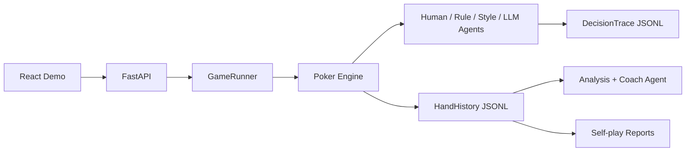

# PokerAgentLab

PokerAgentLab is a multi-agent Texas Hold'em training and evaluation platform built for agent engineering portfolios. It combines a Python poker engine, FastAPI session control, LLM-compatible tool calling, decision tracing, self-play reports, and a lightweight React demo.

## Why This Project Matters

- **Multi-agent runtime**: human, rule-based, style-based, and LLM-backed poker agents share one game engine.
- **Tool-calling decision loop**: LLM agents are prompted with legal actions and parsed into structured poker actions.
- **Observability-first design**: every decision can be traced with observation, legal actions, chosen action, prompt summary, raw response, fallback reason, and latency.
- **Self-play evaluation**: batch experiments report win rate, BB/100, VPIP, PFR, aggression factor, and action distribution.
- **Coach agent**: completed sessions can be reviewed into key findings and training goals.

## Architecture



## Quick Start

```bash
cd C:\Users\93774\Desktop\poker
python -m venv venv
venv\Scripts\python.exe -m pip install -r requirements.txt
copy .env.example .env
venv\Scripts\python.exe -m uvicorn main_api:app --reload --host 127.0.0.1 --port 8000
```

Open the API docs:

```text
http://127.0.0.1:8000/docs
```

Run the frontend:

```bash
cd C:\Users\93774\Desktop\poker\frontend
npm install
npm run dev
```

Open:

```text
http://127.0.0.1:5173
```

## LLM Configuration

LLM play is disabled by default so the demo works without secrets.

Create `.env`:

```env
POKER_LLM_ENABLED=false
POKER_LLM_API_KEY=
POKER_LLM_API_BASE=https://open.bigmodel.cn/api/paas/v4
POKER_LLM_MODEL=glm-4-flash
```

When `POKER_LLM_ENABLED=false` or no key is provided, `style: llm` players automatically fall back to a rule agent so demos and tests still run.

## REST API

Core session flow:

```bash
curl -X POST http://127.0.0.1:8000/sessions ^
  -H "Content-Type: application/json" ^
  -d "{\"session_id\":\"demo1\",\"mode\":\"fixed\",\"num_hands\":3,\"config_path\":\"config/game_config.yaml\"}"

curl http://127.0.0.1:8000/sessions/demo1/state

curl -X POST http://127.0.0.1:8000/sessions/demo1/action ^
  -H "Content-Type: application/json" ^
  -d "{\"action\":\"call\",\"amount\":0}"
```

Observability and analysis:

```text
GET  /sessions/{session_id}/traces
GET  /sessions/{session_id}/hands/{hand_id}/traces
GET  /sessions/{session_id}/history
POST /sessions/{session_id}/analyze
POST /sessions/{session_id}/coach
```

Self-play:

```bash
curl -X POST http://127.0.0.1:8000/experiments/self-play ^
  -H "Content-Type: application/json" ^
  -d "{\"num_hands\":100,\"seed\":42}"
```

Reports are written to:

```text
data/reports/self_play_{experiment_id}.json
data/reports/self_play_{experiment_id}.md
```

## Project Layout

```text
agent/       Agent interfaces and implementations
analysis/    Style review and coach feedback
api/         FastAPI models, sessions, runners, experiments
engine/      Poker rules, betting, pots, showdown
memory/      Hand history, decision logs, decision traces
strategy/    Style profiles and poker heuristics
frontend/    Lightweight React demo
tests/       Minimal smoke tests
```

## Tests

```bash
venv\Scripts\python.exe -m pytest -q
cd frontend
npm run build
```

Current smoke coverage:

- Non-interactive sessions generate hand history and traces.
- API sessions reach `waiting_for_action` and accept legal actions.
- LLM action parsing handles invalid and valid structured actions.

## Docker

```bash
docker compose up --build
```

Backend: `http://127.0.0.1:8000`  
Frontend: `http://127.0.0.1:5173`

## Interview Talking Points

- Designed an agent runtime where model outputs are constrained by legal actions.
- Added graceful LLM fallback so the product remains demoable without API keys.
- Built JSONL traces for debugging agent behavior across hands and sessions.
- Added self-play reports to compare agent styles with poker-specific metrics.
- Separated game engine, API orchestration, memory, analysis, and UI surfaces.
