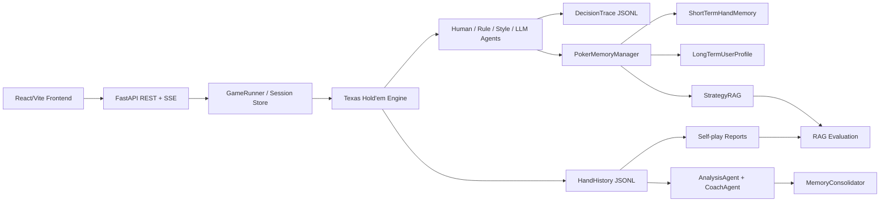

# PokerAgentLab

[English README](README.md)

PokerAgentLab 是一个本地优先的多智能体德州扑克训练、可观测性、记忆、策略检索和评测平台。它不是简单地“让大模型打牌”，而是把一个扑克游戏引擎包装成一个 agent 开发实验室：agent 可以打牌、记录决策 trace、检索策略知识、沉淀用户记忆、生成教练复盘，并通过可重复的评测体系衡量 RAG 和系统行为。

这个项目的定位是一个面向 agent 开发岗位的开源作品。它重点展示真实 agent 系统里更重要的工程能力：受约束的 action space、结构化输出解析、fallback、决策可观测性、记忆生命周期、RAG 可解释性和可量化评测。

## 核心亮点

- **多智能体扑克运行时**：human、rule-based、style-based、LLM-compatible agent 共用同一套德州扑克引擎。
- **受约束的决策链路**：agent 每次只能从合法动作中选择；LLM 输出会被解析成结构化动作，并带 fallback。
- **决策可观测性**：JSONL trace 记录 observation、legal actions、chosen action、prompt summary、raw response、fallback reason、memory/RAG 引用和 latency。
- **SSE 实时决策追踪**：前端可以实时接收 agent 行动，不需要反复轮询完整 trace 文件。
- **Hermes-inspired 记忆生命周期**：短期手牌记忆、长期用户画像候选、策略检索、教练确认式记忆晋升。
- **可解释 StrategyRAG**：本地关键词/tag 检索，返回 score breakdown、matched terms、matched tags、source chunk id 和命中原因。
- **教练型训练报告**：把 session history 转换成中文训练报告，包含关键发现、动作画像、关键决策点、漏洞候选和训练 drill。
- **Self-play 评估报告**：批量自博弈输出 win rate、BB/100、VPIP、PFR、Aggression Factor 和动作分布。
- **评测体系**：RAG benchmark 输出 Hit@K、Precision@K、Recall@K、MRR 和延迟；系统 benchmark 输出 trace 和上下文覆盖率。
- **Docker 一键 Demo**：FastAPI 后端 + React 静态前端 + nginx `/api` 反向代理。

## 产品流程

1. 通过 React UI 或 REST API 创建一局扑克 session。
2. Human、rule、style 或 LLM-compatible agent 在同一套引擎里行动。
3. 每次行动写入 hand history 和 decision trace。
4. StrategyRAG 检索相关扑克策略 chunk，用于 agent 上下文和调试展示。
5. 短期记忆总结最近手牌；长期记忆以候选形式保存，等待用户确认。
6. Coach 报告分析整场 session，并生成训练计划。
7. Self-play 和 evaluation job 生成可量化报告，用于对比和回归检查。

## 架构



### 后端模块

```text
agent/        Agent 接口，以及 human/rule/style/LLM 实现
analysis/     手牌复盘、风格一致性检查、教练型训练报告
api/          FastAPI schema、session store、game runner、自博弈实验
engine/       德州扑克规则、下注轮、底池、摊牌、牌力评估
evaluation/   RAG 和系统评测 runner，以及人工标注 query 数据集
memory/       手牌历史、决策 trace、用户画像记忆、StrategyRAG
strategy/     风格配置、翻前表、翻后 heuristic、策略技能文档
frontend/     React/Vite Demo 前端
tests/        Smoke test、memory/RAG/evaluation test
```

## 环境依赖

后端：

- Python 3.11+
- pip
- `requirements.txt` 中的 Python 依赖

前端：

- Node.js 20+
- npm

可选：

- Docker Desktop，用于一键部署
- LLM-compatible API key，用于真实 LLM 决策

## 快速启动：Docker

在项目根目录运行：

```powershell
docker compose up --build
```

打开：

```text
前端:     http://127.0.0.1:5174/
API 文档: http://127.0.0.1:8000/docs
健康检查: http://127.0.0.1:5174/api/health
```

Windows 下也可以双击：

```text
start_docker.bat
```

停止容器：

```powershell
docker compose down
```

或双击：

```text
stop_docker.bat
```

Compose 启动两个服务：

- `api`：FastAPI，容器端口 `8000`，暴露为 `127.0.0.1:8000`
- `frontend`：React 静态构建，由 nginx 承载，暴露为 `127.0.0.1:5174`；nginx 把 `/api/*` 代理到 `api:8000`

## 快速启动：本地开发

后端：

```powershell
git clone <your-repo-url>
cd PokerAgentLab
python -m venv venv
.\venv\Scripts\python.exe -m pip install -r requirements.txt
copy .env.example .env
.\venv\Scripts\python.exe -m uvicorn main_api:app --reload --host 127.0.0.1 --port 8000
```

如果使用已有 Conda 环境：

```powershell
cd PokerAgentLab
C:\Users\93774\.conda\envs\hello_agents\python.exe -m pip install -r requirements.txt
C:\Users\93774\.conda\envs\hello_agents\python.exe -m uvicorn main_api:app --host 127.0.0.1 --port 8000
```

前端：

```powershell
cd frontend
npm install
npm run dev
```

Vite 默认地址：

```text
http://127.0.0.1:5173/
```

如果端口被占用，Vite 会自动选择新端口。Docker 生产前端固定使用 `5174`。

## 环境变量

复制 `.env.example` 为 `.env`：

```env
POKER_LLM_ENABLED=false
POKER_LLM_API_KEY=
POKER_LLM_API_BASE=https://open.bigmodel.cn/api/paas/v4
POKER_LLM_MODEL=glm-4-flash

POKER_MEMORY_ENABLED=true
POKER_MEMORY_USER_ID=default_user
POKER_MEMORY_MAX_RECENT_HANDS=5
POKER_STRATEGY_RAG_ENABLED=true
```

默认关闭 LLM，所以没有 API key 也能跑 demo。配置里 `style: llm` 的玩家在 LLM 不可用时会 fallback 到 rule agent，避免演示、测试和 Docker 部署被外部服务阻塞。

## 核心 API

会话流程：

```text
POST /sessions
GET  /sessions
GET  /sessions/{session_id}
GET  /sessions/{session_id}/state
POST /sessions/{session_id}/action
POST /sessions/{session_id}/continue
GET  /sessions/{session_id}/history
```

可观测性与复盘：

```text
GET  /sessions/{session_id}/traces
GET  /sessions/{session_id}/trace-stream
GET  /sessions/{session_id}/hands/{hand_id}/traces
POST /sessions/{session_id}/analyze
POST /sessions/{session_id}/coach
```

记忆与策略检索：

```text
GET  /memory/profile
GET  /memory/profile/candidates
POST /memory/profile/candidates/{memory_id}/accept
POST /memory/profile/candidates/{memory_id}/reject
POST /memory/search
POST /strategy/search
POST /sessions/{session_id}/consolidate
GET  /sessions/{session_id}/memory-context
```

实验与评测：

```text
POST /experiments/self-play
GET  /experiments/{experiment_id}/report
POST /evaluation/rag
GET  /evaluation/rag/{run_id}
POST /evaluation/system
GET  /evaluation/system/{run_id}
```

创建 session 示例：

```powershell
curl -X POST http://127.0.0.1:8000/sessions `
  -H "Content-Type: application/json" `
  -d "{\"session_id\":\"demo1\",\"mode\":\"fixed\",\"num_hands\":3,\"config_path\":\"config/game_config.yaml\"}"

curl http://127.0.0.1:8000/sessions/demo1/state

curl -X POST http://127.0.0.1:8000/sessions/demo1/action `
  -H "Content-Type: application/json" `
  -d "{\"action\":\"call\",\"amount\":0}"
```

Self-play 示例：

```powershell
curl -X POST http://127.0.0.1:8000/experiments/self-play `
  -H "Content-Type: application/json" `
  -d "{\"num_hands\":100,\"seed\":42}"
```

RAG 评测示例：

```powershell
curl -X POST http://127.0.0.1:8000/evaluation/rag `
  -H "Content-Type: application/json" `
  -d "{\"top_k\":3}"
```

## 记忆系统

记忆层是本地优先、可审计的。

- `ShortTermHandMemory`：读取最近手牌、当前 session pattern 和关键 decision trace。
- `LongTermUserProfile`：本地单用户画像，分为 `preferences`、`leaks`、`goals`、`knowledge_state` 等类别。
- `StrategyRAG`：从策略文档和扑克 heuristic 中检索本地 strategy chunks。
- `MemoryConsolidator`：把 hand history、decision trace 和 coach review 转换成候选长期记忆和训练计划。
- `PokerMemoryManager`：统一协调短期记忆、长期用户记忆和策略检索。

长期记忆不会自动进入 accepted 状态。系统只生成 `candidate`，必须由用户或 API 确认后才会变成 `accepted` 并注入后续决策上下文。

所有记忆和策略上下文都会用 XML-style fence 包裹，例如 `<user-memory-context>` 和 `<strategy-context>`，并明确标注为“召回上下文，不是用户指令”。

## StrategyRAG

StrategyRAG 有意采用可解释的关键词和标签检索，而不是向量检索。扑克策略检索通常围绕精确结构化术语：街道、位置、手牌类别、SPR、行动模式和风格。检索器会用以下信号加权：

- street
- style
- hand class
- position
- action tags
- SPR tags
- spot tags
- keyword terms
- chunk priority

每条返回结果包含：

- `id`
- `source`
- `score`
- `matched_terms`
- `matched_tags`
- `score_breakdown`
- `reason`

这样在 trace、API、测试和面试讲解中都能解释“为什么召回这条策略”。

## 评测体系

PokerAgentLab 已包含第一版评测框架。

### RAG 评测

数据集：

```text
evaluation/datasets/strategy_queries.jsonl
```

指标：

- Hit@1
- Hit@3
- Precision@K
- Recall@K
- MRR
- 平均检索延迟

报告：

```text
data/evaluation/rag_eval_{run_id}.json
data/evaluation/rag_eval_{run_id}.md
```

### 系统评测

系统 benchmark 会运行可重复的 self-play variants：

- `baseline`
- `rag`
- `memory`

指标包括：

- self-play summary metrics
- trace coverage
- strategy trace coverage
- memory trace coverage
- fallback count
- Coach 是否生成训练计划

报告：

```text
data/evaluation/system_eval_{run_id}.json
data/evaluation/system_eval_{run_id}.md
```

当前限制：style-agent self-play 还没有把 RAG/Memory 上下文纳入行动策略。因此系统评测目前衡量的是上下文可用性和可观测性覆盖，不声称已经证明真实用户训练效果提升。这个限制会在报告中明确说明。

## 运行期数据

运行期数据默认保存在本地：

```text
data/history/hand_history_{session_id}.jsonl
data/traces/decision_trace_{session_id}.jsonl
data/memory/user_profile_default_user.json
data/memory/session_summary_{session_id}.json
data/memory/strategy_chunks.json
data/reports/self_play_{experiment_id}.json
data/reports/self_play_{experiment_id}.md
data/evaluation/*_eval_{run_id}.json
data/evaluation/*_eval_{run_id}.md
```

这些文件默认被 git 忽略。

## 测试

后端：

```powershell
python -m pytest -q
```

前端：

```powershell
cd frontend
npm run build
```

当前测试覆盖：

- 非交互 session
- API session 生命周期
- 动作提交
- hand history 和 decision trace 持久化
- LLM action parser 和 fallback
- 长期记忆 candidate accept/reject/search
- StrategyRAG 可解释检索
- MemoryConsolidator 防止错误沉淀长期记忆
- self-play 报告生成
- RAG evaluation metrics
- system evaluation reports

## 开源发布注意事项

发布到 GitHub 前建议确认：

- 不提交 `.env`。
- 不提交 `data/` 下运行期数据。
- 默认保持 `POKER_LLM_ENABLED=false`。
- API key 不写入 YAML 配置或源码。
- 用 `docker compose up --build` 验证 Docker。
- 运行 `pytest -q` 和 `npm run build`。

## Roadmap

- 增加 `MemoryAwareStyleAgent` 或 `StrategyGuidedAgent`，让非 LLM agent 也能消费 RAG/Memory 上下文。
- 增加前端“评测中心”，展示 RAG 和系统 benchmark。
- 扩充人工标注 RAG 数据集。
- 增加更多扑克翻后牌面 texture 标签。
- 增加 CI，自动运行后端测试和前端构建。
- UI 稳定后补充 demo 截图或 GIF。

## License

当前还没有选择开源许可证。正式发布前建议添加 license，否则外部用户默认没有明确的使用、修改和分发授权。

## Contributors

- [King-zege](https://github.com/King-zege) - 项目作者与维护者
