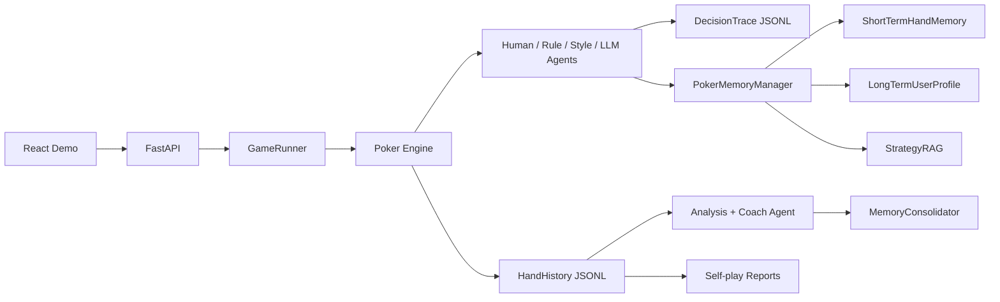

# PokerAgentLab

PokerAgentLab 是一个多智能体德州扑克训练与评估平台。项目把 Python 德州扑克引擎、FastAPI 会话控制、LLM tool calling、决策 trace、自博弈评估、本地记忆/RAG 和 React Demo 串成一个可运行的 agent 产品。

## 项目定位

这个项目想展示的不只是“让大模型打牌”，而是一个更完整的 Agent Lab：

- **多智能体运行时**：支持 human、rule-based、style-based、LLM-backed poker agent 共用同一套牌局引擎。
- **受约束的 tool-calling 决策**：LLM 只能在合法动作集合里选择 fold/check/call/bet/raise/all-in，并被解析成结构化动作。
- **Agent 可观测性**：每次决策都会保存 observation、legal actions、prompt 摘要、LLM raw response、解析结果、fallback reason、latency。
- **Hermes-inspired 记忆生命周期**：短期记忆记录最近手牌和 session pattern，长期记忆保存用户画像候选，StrategyRAG 检索策略知识，Coach 确认后再沉淀长期记忆。
- **自博弈评估**：批量运行 self-play，输出 win rate、BB/100、VPIP、PFR、Aggression Factor、动作分布等指标。
- **教练型复盘 Agent**：从 hand history 和 trace 里提取关键问题，生成训练目标和下一步训练计划。

## 架构



## 快速启动

后端：

```powershell
cd C:\Users\93774\Desktop\Search-R1_1\poker
C:\Users\93774\.conda\envs\hello_agents\python.exe -m uvicorn main_api:app --host 127.0.0.1 --port 8000
```

确认后端可用：

```text
http://127.0.0.1:8000/health
http://127.0.0.1:8000/docs
```

前端：

```powershell
cd C:\Users\93774\Desktop\Search-R1_1\poker\frontend
npm install
npm run dev
```

打开：

```text
http://127.0.0.1:5173
```

如果前端点击 Start 时看到 `connect ECONNREFUSED 127.0.0.1:8000`，说明后端没有启动或 8000 端口不可用。先启动 FastAPI 后端，再刷新前端即可。

## 环境变量

复制 `.env.example` 为 `.env`：

```env
POKER_LLM_ENABLED=false
POKER_LLM_API_KEY=
POKER_LLM_API_BASE=https://open.bigmodel.cn/api/paas/v4
POKER_LLM_MODEL=glm-4-flash

POKER_MEMORY_ENABLED=true
POKER_MEMORY_USER_ID=default_user
POKER_MEMORY_MAX_RECENT_HANDS=5
POKER_STRATEGY_RAG_ENABLED=true
```

默认关闭 LLM，所以没有 API key 也能跑 demo。配置里 `style: llm` 的玩家会自动 fallback 到 rule agent，避免演示时被外部服务阻塞。

## 核心 API

会话与牌局：

```text
POST /sessions
GET  /sessions/{session_id}/state
POST /sessions/{session_id}/action
POST /sessions/{session_id}/continue
GET  /sessions/{session_id}/history
```

观测与复盘：

```text
GET  /sessions/{session_id}/traces
GET  /sessions/{session_id}/trace-stream
GET  /sessions/{session_id}/hands/{hand_id}/traces
POST /sessions/{session_id}/analyze
POST /sessions/{session_id}/coach
```

记忆与策略检索：

```text
GET  /memory/profile
GET  /memory/profile/candidates
POST /memory/profile/candidates/{memory_id}/accept
POST /memory/profile/candidates/{memory_id}/reject
POST /memory/search
POST /strategy/search
POST /sessions/{session_id}/consolidate
GET  /sessions/{session_id}/memory-context
```

自博弈实验：

```text
POST /experiments/self-play
GET  /experiments/{experiment_id}/report
```

## 记忆系统设计

PokerAgentLab 的记忆系统分成四层：

- `ShortTermHandMemory`：读取最近 N 手牌、当前 session 的动作分布、关键 trace，用于短期上下文。
- `LongTermUserProfile`：本地 JSON 用户画像，包含 preferences、leaks、goals、knowledge_state。
- `StrategyRAG`：基于本地策略文件构建轻量检索，不依赖外部向量库，返回 chunk id 和 source。
- `MemoryConsolidator`：从 hand history、decision trace、coach review 中生成候选长期记忆和训练计划。

长期记忆默认不会自动进入 prompt。系统只生成 `candidate`，用户在前端或 API 里 accept 后才会变成 `accepted` 并注入后续决策上下文。

## 数据文件

```text
data/history/hand_history_{session_id}.jsonl
data/traces/decision_trace_{session_id}.jsonl
data/memory/user_profile_default_user.json
data/memory/session_summary_{session_id}.json
data/memory/strategy_chunks.json
data/reports/self_play_{experiment_id}.json
data/reports/self_play_{experiment_id}.md
```

这些运行期数据默认不适合提交到 Git，主要用于本地 demo、复盘和调试。

## 项目结构

```text
agent/       Agent 接口与 human/rule/style/LLM 实现
analysis/    牌局分析、策略偏离检查、教练复盘
api/         FastAPI schema、session store、runner、experiments
engine/      德州扑克规则、下注轮、底池、摊牌
memory/      hand history、decision trace、用户画像、StrategyRAG、记忆沉淀
strategy/    风格配置、翻前表、翻后 heuristic、技能文档
frontend/    React/Vite 轻量 Demo
tests/       smoke test 和 memory system test
```

## 测试

```powershell
cd C:\Users\93774\Desktop\Search-R1_1\poker
C:\Users\93774\.conda\envs\hello_agents\python.exe -m pytest -q

cd frontend
npm run build
```

当前覆盖：

- 非交互 session 能生成 hand history 和 decision trace。
- API session 能进入 waiting_for_action 并提交动作。
- LLM action parser 能处理非法/合法结构化输出。
- 长期记忆 candidate、accept、search 流程。
- StrategyRAG 返回 chunk id 和 source。
- MemoryConsolidator 不会把空 session 或单次结果直接沉淀成长期 leak。

## 面试可讲点

- 如何把 LLM 输出约束到游戏规则允许的 action space。
- 如何设计 Agent observability，让每次决策可追踪、可解释、可 debug。
- 如何在无 API key 时设计 graceful fallback，保证 demo 可运行。
- 如何借鉴 Hermes 的 memory lifecycle，但用本地 provider 实现可复现的求职作品。
- 如何区分 raw hand history、session summary、long-term user profile，避免记忆污染。
- 如何用 self-play 和 coach agent 把“会行动的 agent”升级成“会评估和训练自己的 agent”。
